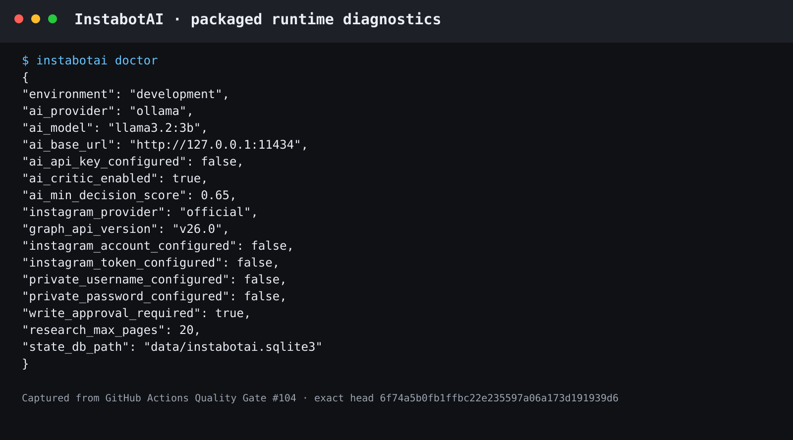
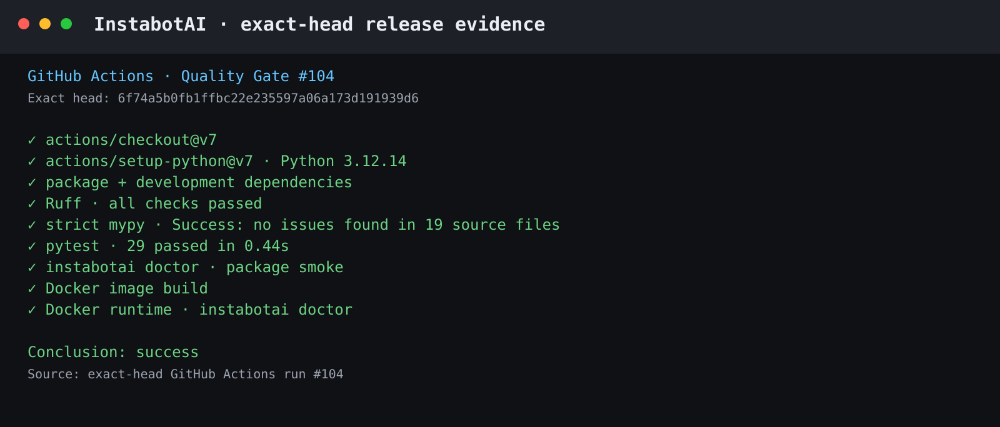

# InstabotAI

InstabotAI is a modern AI decision and Instagram automation runtime built around real model inference, evidence-grounded planning, independent critique, durable decision audit, explicit outcome learning, interchangeable account providers, policy-governed writes, recoverable campaign scheduling, and optional Crawl4AI-powered public-web research.

The 2.0 line does **not** preserve the retired mass-engagement Flask bot as a compatibility layer. The current runtime is Python 3.12+, typed, test-gated, provider-oriented, and deliberately separates account access, research, AI reasoning, campaign state, approval, policy, memory, scheduling, and provider execution.

## Current status

**2.0.0 alpha / consumer-trial hardening**

The current implementation includes the modern runtime, genuine AI decision engine, provider layer, adaptive research, durable SQLite state, campaign scheduler, worker, approval queue, retry-safe execution, outcome learning, CLI, consumer web console, and exact-head quality gates.

The scheduler is durable and recoverable, but the alpha should still be operated under supervision while real account/provider behavior is validated during consumer trials. AI output is never treated as write authority.

## Consumer console

Launch the local-first consumer GUI with:

```bash
instabotai ui
```

The console binds to `127.0.0.1:8765` by default. A non-loopback bind is rejected unless `INSTABOTAI_UI_ALLOW_REMOTE=true` is deliberately configured.

The GUI uses the same `InstabotApplication`, `IntelligenceEngine`, research service, campaign runtime, policy engine, action ledger, and provider adapters as the CLI. It does not contain a second reasoning or execution stack.

The shipped surfaces are:

- **Overview**: secret-free runtime readiness, AI/provider state, decision threshold, research budget, and write-policy state.
- **AI Studio**: genuine model probe, typed evidence authoring, bounded context, planner + critic execution, reviewed score, abstention state, and pending-action inspection.
- **Campaigns**: durable campaign creation, supervised or policy-managed mode, cadence/action-delay controls, optional pre-plan research, manual evidence, activation/pause/archive, immediate planning, approval/rejection, scheduled/retry state, controlled execution, provider/error inspection, and explicit business-outcome recording.
- **Decision Audit**: durable `DecisionJournal` browsing and filtering with stable decision IDs.
- **Adaptive Research**: Crawl4AI-backed public-web research with confidence, relevance, blocked URLs, failed URLs, and early-stop state.
- **Account**: read-only profile retrieval through the selected Instagram provider plus credential-readiness state without exposing secrets.

Campaign execution from the GUI is not a shortcut around policy. A job must be in an executable durable state, required approval must already exist, and the request still flows through `AutomationService`, `AutomationPolicy`, daily limits, transactional quota reservation, idempotency, and the selected Instagram provider.

A successful provider call is also **not** treated as business success. Outcome learning occurs only when an operator explicitly records a bounded reward after a successful action.

## Verified product surfaces

Repository screenshots and evidence must come from real runnable product or CI output. Illustrative dashboards, fabricated command output, mock production states, and retired screenshots are not accepted as product evidence.

### Packaged runtime diagnostics

`instabotai doctor` reports active runtime configuration without contacting Instagram or a model server and without printing secrets.



### Engineering gate

The revival is gated by the same package, strict typing, tests, and container path consumers receive.



See [docs/PRODUCT_SURFACES.md](docs/PRODUCT_SURFACES.md) for the canonical operator/evidence matrix.

## Architecture

```text
Public-web sources                  Operator / product evidence
       |                                      |
       v                                      v
+------------------+                 +-------------------+
| AdaptiveResearch |                 | Typed evidence    |
| Crawl4AI         |                 | bounded context   |
+--------+---------+                 +---------+---------+
         |                                     |
         +------------------+------------------+
                            v
                   +-------------------+
                   | IntelligenceEngine|
                   | planner + critic  |
                   +---------+---------+
                             v
                   +-------------------+
                   | validation +      |
                   | deterministic     |
                   | adjudication      |
                   +---------+---------+
                             v
                   +-------------------+
                   | DecisionJournal   |
                   | stable decision ID|
                   +---------+---------+
                             v
                   +-------------------+
                   | abstain OR        |
                   | PlannedAction     |
                   +---------+---------+
                             v
                   +-------------------+
                   | CampaignStore     |
                   | schedule / lease  |
                   | approval / retry  |
                   +---------+---------+
                             v
                   +-------------------+
                   | AutomationService |
                   | policy + limits   |
                   +---------+---------+
                             v
                   +-------------------+
                   | ActionLedger      |
                   | quota/idempotency |
                   +---------+---------+
                             v
                   +-------------------+
                   | Instagram provider|
                   +---------+---------+
                             v
                   +-------------------+
                   | explicit outcome  |
                   | ExperienceStore   |
                   +-------------------+
```

## Genuine AI decision system

The intelligence layer performs actual language-model inference rather than routing to hard-coded pseudo-intelligence. It supports two reasoning-provider families behind one typed contract:

- **Ollama** for local models. The default points to `http://127.0.0.1:11434`.
- **OpenAI-compatible** servers for hosted or self-hosted chat-completions-compatible deployments.

Model output is never execution authority. The engine validates structured output, contains actions to a caller-supplied vocabulary, scores evidence support and risk deterministically, incorporates only bounded relevant historical reward, applies an independent critic pass, journals the adjudication, and abstains when support is insufficient.

Context, evidence, and candidate payloads are treated as untrusted data rather than instructions. Invalid JSON, schema failures, unsupported actions, provider failures, critic abstention, insufficient reviewed score, and context-boundary failures all fail closed.

Every production reasoning result, including abstentions, receives a stable `decision_id` and is persisted in `DecisionJournal`. AI-selected Instagram work becomes a `PlannedAction` with `ApprovalState.PENDING`. The model cannot approve its own write, disable limits, bypass idempotency, weaken provider/security controls, or call around `AutomationService`.

Real observed outcomes are stored separately in `ExperienceStore`. They influence future scoring only as a bounded relevance-weighted prior and cannot replace current evidence or policy.

See [docs/INTELLIGENCE_ARCHITECTURE.md](docs/INTELLIGENCE_ARCHITECTURE.md) for the authority model.

## Durable campaigns and worker

Campaigns turn reviewed intelligence into recoverable work without introducing another reasoning stack.

Each campaign stores its objective, evidence, bounded context, optional public-web research seeds, cadence, action delay, mode, planning state, and failure state. The runtime allows only one open action per campaign at a time.

Planning and execution use expiring ownership leases so crashed workers can recover without permanently locking work. Action retries retain the same idempotency identity only for the exact same action, while successful/reserved actions remain protected from replay.

Modes:

- **`supervised`**: planned writes enter `pending_approval` before scheduling.
- **`policy_managed`**: campaign mode can omit the campaign-level approval queue only when global write policy also permits it. `INSTABOTAI_REQUIRE_WRITE_APPROVAL=true` remains authoritative regardless of campaign mode.

The worker can run continuously or for one deterministic scheduler tick:

```bash
instabotai worker
instabotai worker --once
```

Worker flow:

```text
claim due campaign -> research/evidence -> planner/critic -> journal decision
-> enqueue durable job -> approval if required -> claim due job
-> AutomationService -> provider -> explicit business outcome
```

Provider success and business success are intentionally separate facts.

## Instagram providers

InstabotAI has one provider contract and two backends.

**Official provider** is the default and uses Instagram API with Instagram Login on `graph.instagram.com` for supported professional-account operations.

**Private provider** is optional and uses the maintained `instagrapi` client as an authorized-account compatibility path. It reuses persistent session state and may require normal Instagram verification. InstabotAI does not implement security-checkpoint defeat or anti-abuse evasion.

Both providers remain behind the same `AutomationService`, policy checks, idempotency ledger, and audit trail.

## Adaptive research

The optional `research` extra uses Crawl4AI to explore permitted public-web sources. It ranks discovered links against the objective, bounds page count, tracks confidence, and can stop early when additional crawling has low expected information gain.

Meta-owned social domains are blocked from the generic crawler by default. Instagram account data belongs to the provider layer rather than website scraping.

## Installation

Create a Python 3.12+ environment and install the capabilities you need:

```bash
python -m pip install -U pip
python -m pip install -e .
```

Optional extras:

```bash
python -m pip install -e '.[private]'
python -m pip install -e '.[research]'
python -m pip install -e '.[dev]'
```

Extras can be combined, for example `.[private,research,dev]`.

## Quick start

Launch the GUI:

```bash
instabotai ui
```

Inspect secret-free configuration:

```bash
instabotai doctor
```

Probe the configured reasoning model with a genuine structured inference call:

```bash
instabotai ai-check
```

Run one reviewed plan without execution:

```bash
instabotai plan "Publish the approved product announcement" \
  --evidence-file ./evidence.json
```

Create a durable supervised campaign from the same evidence contract:

```bash
instabotai campaign-create "Product launch" \
  "Publish evidence-grounded launch content and learn from measured outcomes" \
  --evidence-file ./evidence.json \
  --mode supervised \
  --cadence-minutes 1440
```

Operate the campaign lifecycle:

```bash
instabotai campaigns
instabotai campaign-activate CAMPAIGN_ID
instabotai campaign-plan CAMPAIGN_ID
instabotai campaign-jobs --campaign-id CAMPAIGN_ID
instabotai campaign-approve JOB_ID
instabotai campaign-execute JOB_ID
instabotai campaign-outcome JOB_ID --reward 0.8 --note "Measured outcome after execution"
```

Run the scheduler:

```bash
instabotai worker
```

Other read/research commands:

```bash
instabotai decisions --limit 25
instabotai profile
instabotai research "local fitness marketing trends" \
  --seed https://example.com/fitness-market-report
```

The evidence file is a JSON array of typed records containing `evidence_id`, `source`, `content`, and optional `confidence`. Optional context files contain a bounded JSON object.

## Configuration

Runtime settings use the `INSTABOTAI_` prefix. Secrets belong in environment variables or an operator-controlled local secret mechanism, never in the repository.

### Consumer UI

```bash
export INSTABOTAI_UI_HOST='127.0.0.1'
export INSTABOTAI_UI_PORT='8765'
export INSTABOTAI_UI_OPEN_BROWSER='true'
```

Non-loopback binds require:

```bash
export INSTABOTAI_UI_ALLOW_REMOTE='true'
```

AI, research, and campaign browser operations have separate bounded concurrency controls through `INSTABOTAI_UI_AI_MAX_CONCURRENCY`, `INSTABOTAI_UI_RESEARCH_MAX_CONCURRENCY`, and `INSTABOTAI_UI_CAMPAIGN_MAX_CONCURRENCY`.

### AI runtime

Local Ollama default:

```bash
export INSTABOTAI_AI_PROVIDER=ollama
export INSTABOTAI_AI_MODEL='llama3.2:3b'
export INSTABOTAI_AI_BASE_URL='http://127.0.0.1:11434'
```

OpenAI-compatible server:

```bash
export INSTABOTAI_AI_PROVIDER=openai_compatible
export INSTABOTAI_AI_MODEL='your-model-id'
export INSTABOTAI_AI_BASE_URL='https://your-model-server.example'
export INSTABOTAI_AI_API_KEY='...'
```

### Official provider

```bash
export INSTABOTAI_INSTAGRAM_PROVIDER=official
export INSTABOTAI_INSTAGRAM_ACCESS_TOKEN='...'
export INSTABOTAI_INSTAGRAM_ACCOUNT_ID='...'
```

### Private provider

Install `.[private]`, then configure:

```bash
export INSTABOTAI_INSTAGRAM_PROVIDER=private
export INSTABOTAI_PRIVATE_INSTAGRAM_USERNAME='...'
export INSTABOTAI_PRIVATE_INSTAGRAM_PASSWORD='...'
```

The private adapter stores reusable local session state and attempts to restrict its permissions on platforms that support POSIX permissions. Authorized research instrumentation can be enabled separately; platform security challenges remain Instagram-controlled.

## Write safety and execution guarantees

The canonical write path enforces:

- typed `PlannedAction` records;
- human approval whenever global policy or supervised campaign mode requires it;
- minimum confidence threshold;
- hard daily action limits;
- transactionally reserved quotas;
- durable idempotency keys;
- recoverable scheduler leases;
- bounded retry state;
- succeeded/failed provider audit state;
- one provider-independent execution path;
- separate, explicit post-execution business outcomes.

Direct provider objects are integration adapters, not application orchestration authority.

## Development gates

The GitHub Actions quality gate validates the complete modern source tree:

```bash
python -m ruff check instabotai tests
python -m mypy instabotai
python -m pytest
instabotai doctor
docker build -t instabotai-ci .
docker run --rm instabotai-ci doctor
```

The test suite includes planner/critic behavior, fail-closed model output, outcome learning, durable journaling, allowed-action containment, Ollama/OpenAI-compatible HTTP contracts, provider failure propagation, policy boundaries, action ledger behavior, campaign leases, stale-worker recovery, idempotent retries, complete plan/approve/execute/outcome learning, consumer APIs, browser asset delivery, JavaScript parser checks when Node is available, secret-free runtime status, and remote-bind safety.

The container gate also boots the consumer console and requires `/healthz` to become healthy.

Mypy runs in strict mode. Production mocks and silent AI fallbacks are intentionally excluded. When reasoning is unavailable or invalid, the intelligence engine abstains.

## Project direction

The campaign/scheduling layer is now implemented. The next product work should focus on consumer-trial evidence, authenticated provider validation, operator ergonomics, observability, and release hardening rather than adding a parallel automation architecture.

The objective/evidence/candidate/critique/outcome contracts remain domain-neutral so future surfaces can reuse the intelligence substrate without duplicating model orchestration.

## Legal

InstabotAI is independent software and is not affiliated with or endorsed by Instagram or Meta.

The official provider uses supported Meta interfaces. The optional private provider relies on an unofficial client and can be affected by Instagram protocol changes, account trust checks, or platform terms. Users are responsible for operating their accounts and automations appropriately.

See `LICENSE` and `LICENSE_PREMIUM` for licensing terms.
