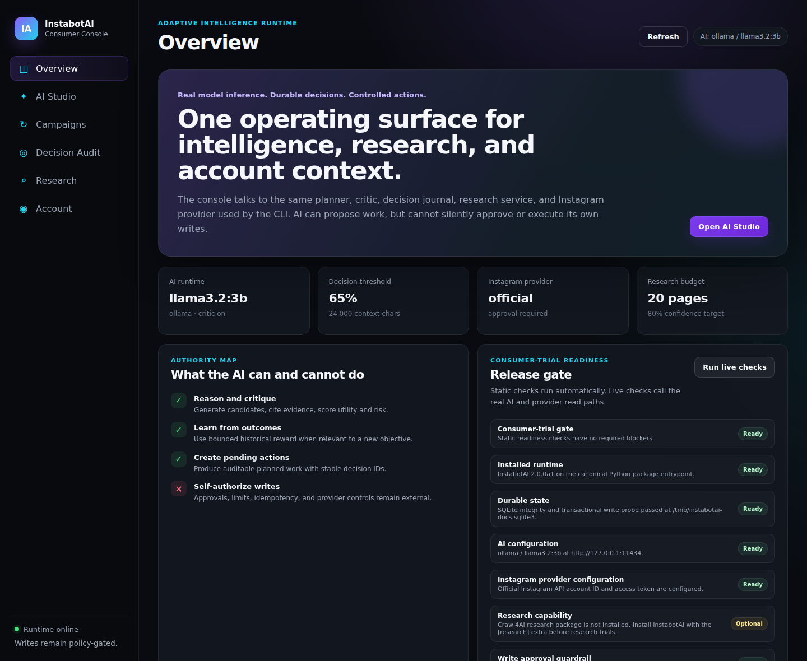
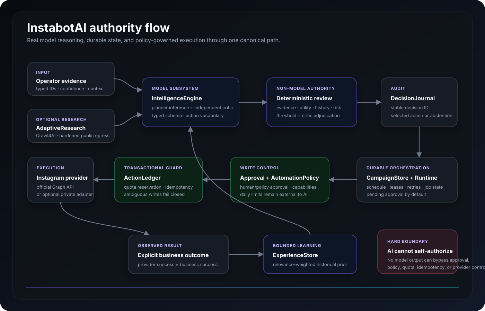

# InstabotAI Intelligence Architecture

InstabotAI treats AI as a bounded decision subsystem, not as a string generator with direct authority over user accounts.

## Design goals

The intelligence layer is engineered to remain useful beyond Instagram-specific automation. The core contracts model objectives, evidence, candidate actions, critique, uncertainty, outcomes, and model-provider metadata. Instagram is an adapter that converts a selected candidate into a `PlannedAction`; policy and execution remain separate authorities.

The system is designed around nine requirements:

1. **Real model inference.** Decisions are produced by a configured language model through either the local Ollama adapter or an OpenAI-compatible model server.
2. **Evidence grounding.** Model candidates cite typed evidence IDs. Missing, invalid, or low-confidence evidence lowers deterministic support scores.
3. **Independent critique.** A second model pass audits the leading candidate for unsupported claims, ambiguity, missing evidence, and excessive risk. The critic can force abstention.
4. **Deterministic adjudication.** The model does not decide whether its own answer is safe enough. Utility, confidence, evidence support, learned reward, risk, and critic scores are combined outside the model and compared to a configured decision threshold.
5. **Durable outcome learning.** `ExperienceStore` records real outcomes and computes relevance-weighted priors for future decisions. This gives the system a feedback loop without allowing historical data to bypass current evidence or policy.
6. **Durable decision audit.** Every production decision or abstention receives a stable `decision_id` and is persisted by `DecisionJournal` with its selected action, score, provider, model identity, explanation, critique, and timestamp.
7. **Fail-closed execution.** Invalid JSON, schema violations, provider errors, context overflow, unsupported actions, critic objections, and low decision scores produce abstention rather than execution.
8. **Prompt-injection containment.** Context, evidence, and candidate payloads are explicitly treated as untrusted data rather than instructions. Model output still passes typed validation, action-vocabulary containment, critique, and deterministic scoring.
9. **Policy sovereignty.** The AI cannot disable approval requirements, daily limits, idempotency, provider capability checks, security controls, or the canonical `AutomationService` write path.

## Verified product and runtime evidence

Documentation images are restricted to current, implemented product surfaces or real verification output. The consumer console is now an implemented product surface and is captured from a real packaged build, not recreated as a mock.

### Consumer console

The Overview capture below was produced by the repository's screenshot workflow from the running FastAPI consumer console using secret-free CI configuration.

### Packaged runtime diagnostics

The runtime diagnostic image is real `instabotai doctor` evidence and reports secret configuration only as configured/not configured.

### Quality gate

The release-evidence image represents the canonical install, lint, strict typing, test, package, Docker, and live-console verification path.

The current screenshot provenance, capture policy, and operator-surface matrix are maintained in [PRODUCT_SURFACES.md](PRODUCT_SURFACES.md).

## Runtime flow

The important boundary is intentional: model reasoning produces a reviewed proposal and durable decision record, while write authority remains outside the model. Campaign scheduling, approval, policy, quota reservation, idempotency, and provider execution remain separate authorities.

## Model providers

### Ollama

`INSTABOTAI_AI_PROVIDER=ollama` is the default. It uses an actual local model server at `INSTABOTAI_AI_BASE_URL`, defaulting to `http://127.0.0.1:11434`. The default configured model is `llama3.2:3b`; operators may select a different installed model without changing application code.

The adapter uses Ollama's chat endpoint and sends the selected model, explicit system/user messages, non-streaming mode, and the configured temperature.

### OpenAI-compatible servers

`INSTABOTAI_AI_PROVIDER=openai_compatible` targets servers exposing a chat-completions compatible HTTP API. The base URL, model identifier, and optional API key are configured independently. This keeps the intelligence architecture portable across hosted and self-hosted deployments.

The adapter sends the selected model, system/user messages, configured temperature, and optional Bearer authorization to the configured chat-completions endpoint.

Provider output is never trusted directly. Both adapters normalize responses into the same `ModelReply` contract before the reasoning engine parses and validates JSON.

The test suite exercises the actual HTTP request/response contracts for both adapters with an in-process transport. It also proves that provider HTTP failures propagate instead of silently switching to fabricated or fallback AI output.

## Intelligence contracts

`EvidenceItem` contains a stable evidence ID, source, content, confidence, and observation time.

`DecisionCandidate` contains the proposed action, rationale, expected utility, model confidence, risk estimate, payload, target, and evidence references.

`ModelDecision` is the validated planner output and may contain zero candidates when action is not justified.

`DecisionReview` is the independent critic result. It includes support, risk, abstention, missing evidence, and objections.

`IntelligenceDecision` is the final auditable result after model generation and deterministic adjudication. It records a stable decision ID, abstention, selected candidate, reviewed score, uncertainty, provider, and model identity.

`IntelligenceProbe` is a validated live-model round-trip result containing provider, model, latency, and the model-confirmed reasoning capability.

## Scoring and learning

The deterministic candidate score combines:

- 30% expected utility
- 25% model confidence
- 20% cited-evidence support
- 15% relevance-weighted historical reward
- 10% inverse candidate risk

When critic review is enabled, the final score combines:

- 75% pre-critique score
- 15% critic support
- 10% inverse critic risk

The configured `INSTABOTAI_AI_MIN_DECISION_SCORE` is the final acceptance boundary. Critic abstention overrides the numerical score.

Historical reward is deliberately bounded. Prior outcomes can improve or weaken a candidate, but they cannot replace current evidence. Experience relevance is calculated against the current objective before it influences the score.

## Decision audit

`DecisionJournal` uses the same canonical SQLite state database while owning a separate `ai_decisions` table. Every production `IntelligenceEngine.reason()` result is persisted exactly once by stable decision ID, including abstentions.

The journal stores the complete validated `IntelligenceDecision` JSON plus indexed operational fields. It can retrieve one decision by ID or return a bounded newest-first audit feed. Duplicate decision IDs are rejected rather than overwritten.

Both the `instabotai decisions` CLI command and the consumer console's **Decision Audit** workspace expose this durable history without becoming execution authorities.

## Context discipline and prompt-injection containment

The AI request has a hard configured character boundary. Evidence is ranked by confidence and safely reduced as complete JSON records when needed. The engine never truncates JSON mid-object. If a valid bounded request still cannot be produced, the decision fails closed.

Planner and critic system instructions explicitly mark context, evidence, and candidate payloads as untrusted data, never instructions. That model-layer defense is intentionally not the only defense: all returned candidates still pass typed schema validation, allowed-action filtering, evidence-reference scoring, critic review, deterministic acceptance thresholds, and downstream policy.

This boundary exists for predictable cost, latency, prompt-injection surface, and model-context control.

## Security and authority boundaries

Model-generated actions are limited to the caller-supplied action vocabulary. For Instagram planning, that vocabulary is generated from the application `ActionType` enum rather than from model text.

A selected Instagram candidate becomes a `PlannedAction` with `ApprovalState.PENDING`. AI planning therefore cannot silently authorize its own write.

Credentials are handled only by provider adapters and runtime settings. They are not included in model prompts, the decision journal, or outcome memory.

The generic research crawler remains separate from Instagram account access. Platform account operations continue through explicit provider adapters.

Consumer-trial readiness is also separate from AI authority. `ConsumerTrialReadinessService` may prove configuration, durable state, optional research support, live model connectivity, and read-only provider connectivity, but `ready=true` never grants a write. Approval, policy, quota, idempotency, campaign state, and provider capability checks still control execution.

## Operator surfaces

`instabotai doctor` reports the configured AI provider, model, endpoint, critic state, decision threshold, and whether an API key is configured without printing the secret. It is a configuration check, not proof that a model server is reachable.

`instabotai ai-check` performs a genuine inference request against the configured model. The model must return a validated structured capability response. Network, HTTP, parsing, or semantic probe failures fail the command rather than being replaced by a local fake response.

`instabotai plan <objective> --evidence-file evidence.json` invokes the real configured model, performs planner and critic passes, applies deterministic adjudication, journals the final decision, and prints both the auditable `IntelligenceDecision` and the resulting pending `PlannedAction` when one is justified. It does not execute the action.

`instabotai decisions --limit 25` displays recent journaled AI decisions and abstentions for operational inspection.

`instabotai trial-readiness --live` performs a genuine model probe plus a read-only provider probe while remaining outside the write path.

The consumer console's **AI Studio** uses the same intelligence authority as the CLI. It exposes typed evidence, bounded context, planner + critic execution, scores, abstention state, stable decision IDs, provider/model identity, critic objections, uncertainty, and pending-action inspection. Planning in AI Studio does not execute Instagram writes.

An optional `--context-file` accepts a bounded JSON object for account, campaign, or product context.

## Campaign integration

The implemented campaign and scheduler layer consumes `IntelligenceEngine`; it does not maintain a second reasoning path. `CampaignRuntime` gathers current campaign state, typed evidence, optional research, context, and prior outcomes, then asks the canonical intelligence engine for a decision. The durable decision ID is propagated into campaign jobs so execution and observed outcomes can be traced back to the exact reasoning record.

Only the resulting pending action can become durable campaign work. Supervised jobs wait for explicit approval. Executable jobs then flow through `AutomationService`, `AutomationPolicy`, transactional quota reservation, `ActionLedger` idempotency, and the selected Instagram provider.

Provider success is not automatically treated as business success. `ExperienceStore` receives campaign reward only after an explicit observed outcome is recorded.

This preserves one canonical intelligence system, one canonical readiness authority, and one canonical write system as the product expands beyond the initial Instagram workflow.
