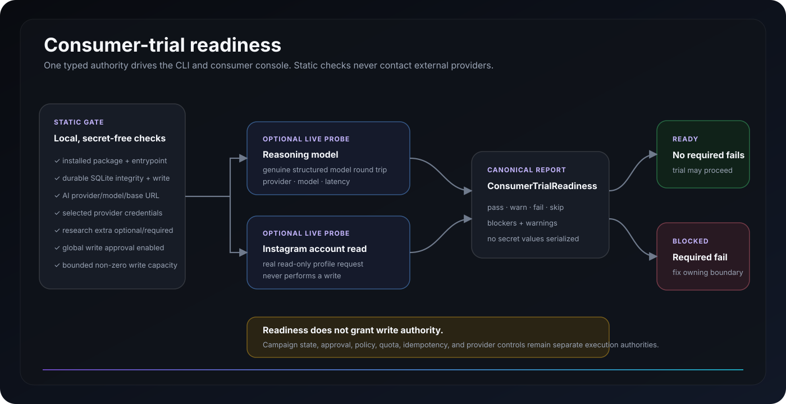

# InstabotAI Product Surfaces

This page is the canonical visual and operational evidence index for the current InstabotAI 2.x revival.

## Evidence policy

Documentation must represent a surface that exists in the current product or real verification output produced by a runnable build. Do not add speculative dashboards, placeholder UI, fabricated command output, mock production states, credential-dependent success screens presented as generic evidence, or screenshots copied from the retired application.

The consumer console is backed by the same canonical `InstabotApplication`, `IntelligenceEngine`, `DecisionJournal`, `CampaignRuntime`, provider adapters, research service, policy engine, readiness service, and durable-state authorities used by the CLI. The GUI does not implement a parallel reasoning or execution stack.

Explanatory SVG diagrams may simplify a real architecture or control flow, but they must map to current code authorities and must never be presented as runtime screenshots.

## Visual evidence inventory

| Asset | Kind | Purpose | Provenance |
| --- | --- | --- | --- |
| `screenshots/consumer-console-overview.png` | Real product screenshot | Current packaged Overview/readiness surface | Docs Visual Capture run `35649566887`; source head `e947c1380e70210fa5f4f55742f21818368cb916`; product code based on merged `master@d7181ed4eb957538a2a3c93453dcd54d416e9b5c`; capture committed as `0baba46c5e2545e46468d29fc4e91729693172f0` |
| `screenshots/runtime-doctor.svg` | Runtime evidence | Secret-free packaged runtime/config diagnostics | Retained original exact-head evidence; not relabeled as newer output |
| `screenshots/quality-gate.svg` | CI evidence | Release-gate status for its documented baseline | Retained original exact-head evidence; newest workflow/PR remains authoritative |
| `screenshots/architecture-flow.svg` | Explanatory diagram | Current reasoning → durable state → write-control → provider → outcome path | Derived from current canonical runtime authorities |
| `screenshots/consumer-trial-readiness.svg` | Explanatory diagram | Static/live readiness ownership and separation from write authority | Derived from `ConsumerTrialReadinessService` and current API/CLI surfaces |

The real console capture is reproducible. Run the manual **Docs Visual Capture** workflow (`.github/workflows/docs-visual-capture.yml`) against the branch whose UI you intend to document. The workflow installs the package, boots the real local console, waits for `/healthz`, captures the Overview with headless Chrome, and commits the PNG. It does not claim authenticated Instagram or model success.

## Consumer console

**Launch:** `instabotai ui`  
**Default bind:** `127.0.0.1:8765`  
**Remote bind:** rejected unless `INSTABOTAI_UI_ALLOW_REMOTE=true` is deliberately enabled.  
**Write authority:** policy-mediated only. Browser requests continue through durable campaign state, approval, policy, quota, idempotency, ledger, and provider authorities.

### Overview

This is a real packaged-console capture from the source/provenance recorded above. The capture uses non-secret CI-only provider configuration so the static readiness surface can render. It is **not** evidence of authenticated provider or live-model success.

Overview exposes:

- secret-free runtime readiness;
- configured AI provider and model;
- critic and decision-threshold state;
- selected Instagram provider readiness;
- durable-state health;
- research package/profile state;
- global write-approval and bounded write-capacity checks;
- static/live `ConsumerTrialReadiness` status;
- a **Run live checks** control for genuine AI + read-only Instagram probes.

### AI Studio

The AI Studio is an operator surface for the genuine intelligence system, not a decorative chat wrapper.

It provides:

- genuine live-model probe;
- objective authoring;
- typed evidence authoring with stable evidence IDs, source, confidence, and content;
- bounded JSON context;
- planner inference and schema validation;
- allowed-action containment;
- deterministic evidence/history/utility/risk scoring;
- independent critic review;
- abstention inspection;
- final reviewed score and stable decision ID;
- provider/model identity;
- candidate confidence, expected utility, risk, and evidence references;
- critic objections and missing evidence;
- assumptions and uncertainty;
- pending-action payload inspection;
- copyable decision JSON.

Planning from AI Studio never executes an Instagram write directly.

### Campaigns

The Campaigns surface is the durable automation workspace.

Campaign creation exposes campaign name/objective, supervised or policy-managed mode, planning cadence, action delay, typed evidence, bounded context, and optional public-web research seeds.

Lifecycle controls expose draft, active, paused, and archived states; plan-now; next/last planning time; planning failure count; and current campaign evidence/mode.

Job controls expose:

- pending approval, scheduled, leased, retry, succeeded, failed, rejected, and cancelled states;
- action type, reason, confidence, schedule, attempts, decision ID, and job ID;
- explicit approve/reject controls;
- controlled execution only from executable durable states;
- cancellation of open unleased work;
- action payload and idempotency-key inspection;
- execution error and provider-result inspection;
- explicit post-success business reward/note recording.

Provider success is not automatically treated as business success. `ExperienceStore` receives campaign feedback only after an explicit business outcome is recorded.

The browser does not bypass the write spine:

`CampaignRuntime -> AutomationService -> AutomationPolicy -> ActionLedger -> Instagram provider`

### Decision Audit

- newest-first durable `DecisionJournal` feed;
- decision ID, objective, reviewed score, selected/abstained state, action, timestamp, provider, and model;
- filtering and click-through into the full AI inspector.

### Adaptive Research

The consumer research surface uses the canonical Crawl4AI-backed service and exposes objective, multiple seed URLs, confidence, early-stop state, per-page relevance, excerpts, blocked URLs, and failed URLs.

The egress boundary includes:

- HTTP/HTTPS-only destinations;
- no URL userinfo credentials;
- blocked-domain and optional allowed-domain policy;
- rejection of unsafe literal IP addresses;
- DNS resolution before fetch, requiring every returned address to be globally routable;
- rejection of loopback, RFC1918/private, link-local, multicast, reserved, and unspecified addresses;
- checks for IPv4-mapped IPv6, 6to4, Teredo, and NAT64 embedded addresses;
- Chromium request routing that revalidates every HTTP(S) navigation, redirect, and subresource before continuing;
- final fetched-URL validation before accepting content.

Meta-owned social domains remain blocked by default. Instagram account data belongs to provider adapters rather than the generic crawler.

### Account

- read-only profile retrieval through the selected Instagram provider;
- official/private provider state;
- credential readiness as configured/not configured only;
- no token or password values returned to the browser;
- current write-approval state.

## Consumer-trial readiness surface

The CLI command `instabotai trial-readiness` and the Overview API use one canonical `ConsumerTrialReadinessService`.

Static checks verify package/runtime identity, truly durable SQLite state, AI configuration, selected-provider credential completeness, research-extra availability according to the chosen trial profile, write approval, and bounded write capacity. Live mode adds genuine model inference plus a read-only Instagram profile request. Readiness reports are secret-free and do not grant write authority.

See [CONSUMER_TRIAL_READINESS.md](CONSUMER_TRIAL_READINESS.md).

## Durable worker surface

`instabotai worker` is the recoverable campaign scheduler/execution worker. `instabotai worker --once` performs one deterministic tick for verification or external scheduling.

The worker claims a due campaign using an expiring lease, gathers evidence/research, calls the canonical intelligence engine, journals the reviewed decision, creates at most one open campaign job, waits for approval when required, claims executable work using an execution lease, writes through the canonical automation service, and persists retry/success/failure state. Business-outcome learning remains explicit after provider success.

Stale leases are recoverable. Retries keep the original action identity rather than minting replacement work.

## Write retry and idempotency boundary

The official Graph provider automatically retries only safe/read methods (`GET`, `HEAD`, and `OPTIONS`). POST requests are single-dispatch at the provider layer.

If a POST times out or otherwise has an unknown remote outcome, it raises `AmbiguousWriteError`. `AutomationService` records that action as a non-retryable failure in `ActionLedger`; the same idempotency key cannot be replayed, and the ambiguous action continues to count against the daily quota because Instagram may already have completed it.

Known explicit rejections such as rate limiting can remain retryable at the outer durable scheduler layer, but only for the exact same action identity/payload.

Daily quota checking and reservation occur atomically in SQLite and include in-flight reservations, succeeded actions, and ambiguous non-retryable writes.

## Browser/API security boundary

The consumer API adds browser-specific safeguards on top of application authorities:

- loopback-only bind by default;
- explicit opt-in for non-loopback binds;
- self-only CSP for scripts/styles/connectivity;
- `X-Frame-Options: DENY`;
- `X-Content-Type-Options: nosniff`;
- `Referrer-Policy: no-referrer`;
- restrictive `Permissions-Policy`;
- `Cache-Control: no-store` on `/api/*`;
- independently bounded AI, research, and campaign concurrency;
- structured provider/runtime/campaign errors;
- no browser disclosure of unexpected server stack traces.

Campaign browser code remains modular: the original core console is preserved separately from campaign bootstrap/UI modules, and startup is guarded across `DOMContentLoaded` timing.

## Runtime diagnostics

**Surface:** `instabotai doctor`  
**Purpose:** inspect runtime configuration without contacting Instagram or a reasoning model.  
**Secrets:** reported only as configured/not configured.

The screenshot remains tied to the build that actually produced it. It is not silently relabeled as a newer capture.

## Release evidence

The canonical GitHub Actions Quality Gate proves the proposed source tree installs, type-checks, tests, packages, builds into a container, and starts both the CLI and consumer console.

The current gate requires:

- Python 3.12 package/development installation;
- Ruff across `instabotai` and tests;
- strict mypy across production source;
- complete pytest suite;
- consumer static-asset/API regressions;
- installed `instabotai doctor` smoke;
- FastAPI application creation smoke;
- a freshly built wheel installed in a clean virtual environment;
- clean-wheel `trial-readiness` smoke;
- Docker image build;
- packaged `doctor` and `trial-readiness` inside Docker;
- consumer-console startup inside Docker;
- successful container `/healthz` response.

## Operator surface matrix

| Surface | Status | External systems | Write authority |
| --- | --- | --- | --- |
| `instabotai doctor` | Implemented | No | None |
| `instabotai trial-readiness` | Implemented | No in static mode | None |
| `instabotai trial-readiness --live` | Implemented | Reasoning model + Instagram provider read | None |
| `instabotai ai-check` | Implemented | Reasoning model | None |
| `instabotai plan` | Implemented | Reasoning model | Pending action only |
| `instabotai decisions` | Implemented | Local SQLite | Read-only |
| `instabotai profile` | Implemented | Instagram provider | Read-only |
| `instabotai research` | Implemented with research extra | Public web through hardened egress policy | None |
| `instabotai campaign-create` | Implemented | Local durable state | Draft only |
| `instabotai campaign-plan` | Implemented | Model + optional research | Durable job or abstention |
| `instabotai campaign-approve/reject` | Implemented | Local durable state | Approval state only |
| `instabotai campaign-execute` | Implemented | Instagram provider | Canonical policy-mediated path |
| `instabotai campaign-outcome` | Implemented | Local durable state | Learning signal only |
| `instabotai worker` | Implemented | Model/research/provider as work requires | Canonical policy-mediated path |
| Consumer Overview | Implemented | Local runtime; optional live probes | None |
| Consumer AI Studio | Implemented | Reasoning model | Pending action only |
| Consumer Campaigns | Implemented | Model/research/provider as requested | Approval + canonical execution |
| Consumer Decision Audit | Implemented | Local SQLite | Read-only |
| Consumer Research | Implemented | Public web through hardened egress policy | None |
| Consumer Account | Implemented | Instagram provider | Read-only |

## Current consumer-trial verification baseline

Consumer-trial readiness code was validated on exact candidate `12f93f1d5647ff173c19fb3dd88d94a1ca425638` with Quality Gate #153 before merge to `master@d7181ed4eb957538a2a3c93453dcd54d416e9b5c`:

- Ruff green;
- strict mypy green across 27 production source files;
- **66 pytest tests passed**;
- package smoke green;
- clean-wheel install and readiness smoke green;
- Docker build, packaged runtime readiness, and consumer `/healthz` green.

The PR description and newest exact-head GitHub Actions run remain the authority if later commits advance the branch.

## Why authenticated screenshots remain selective

A real `ai-check` requires a reachable model. Real Instagram profile/write evidence requires account credentials. Repository documentation must not manufacture provider success, embed private account data, or substitute mock content just to make the product look populated.

The current Overview screenshot intentionally proves the packaged UI and static readiness presentation only. Authenticated provider/model screenshots should be added only from controlled real trials with secrets and private account identifiers absent or redacted.

## Updating visual evidence

When a product surface changes:

1. verify it against the current exact-head build;
2. for the Overview, run the manual **Docs Visual Capture** workflow rather than drawing a replacement screenshot;
3. capture only real product/runtime output;
4. remove or redact secrets and private identifiers;
5. store visual captures under `docs/screenshots/`;
6. record the exact source head/run/release that produced them;
7. update this matrix and README;
8. remove obsolete visual evidence when the corresponding surface no longer exists.
